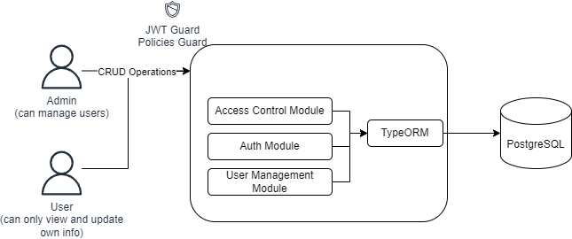

## Description

This is a user management API developed with NestJS, TypeORM, and PostgreSQL as a database, with the following modules:

1. **Auth Module**: module for authentication with the APIs
- login: API to authenticate
- profile: API to get the current logged in user
- register: API to create a new "User" account


2. **Users Management Module**: module for user management with full access for "Admin" and own access for "User"
- `POST /users` -> create a new user
- `GET /users` -> get the list of all users
- `GET /users/:id` -> get a user by id ("User" can only get its own info)
- `PATCH /users/:id` -> update a user by id ("User" can only update its own info)
- `DELETE /users/:id` -> delete a user by id



## Prerequisites

Before you can run this project, you need to have the following installed on your machine:

1. Node.js (v20 or later)
2. npm (v10.5.0 or later)
3. Docker compose (v2.13.0 or later)

## Installation

1. Clone the repository to your local machine.
2. Navigate to the project directory in your terminal.
3. Initialize the docker container with the command `docker compose up -d`
3. Create a .env file in the root directory of the project and add the following details:
```bash
POSTGRES_HOST=127.0.0.1
POSTGRES_PORT=5432
POSTGRES_USER=um_user
POSTGRES_PASSWORD=BDGvMR9fd7psXKVJ //same as in "docker-compose.yaml" file
POSTGRES_DATABASE=um_db
PORT=3000
MODE=DEV
JWT_SECRET=<<your_secret_key>>
JWT_EXPIRATION_TIME=60m
```
4. Run `npm install` to install the dependencies.


## Running the app

```bash
# development
$ npm run start

# watch mode
$ npm run start:dev

# production mode
$ npm run start:prod
```

## Test

```bash
# unit tests
$ npm run test

# e2e tests
$ npm run test:e2e

# test coverage
$ npm run test:cov
```
